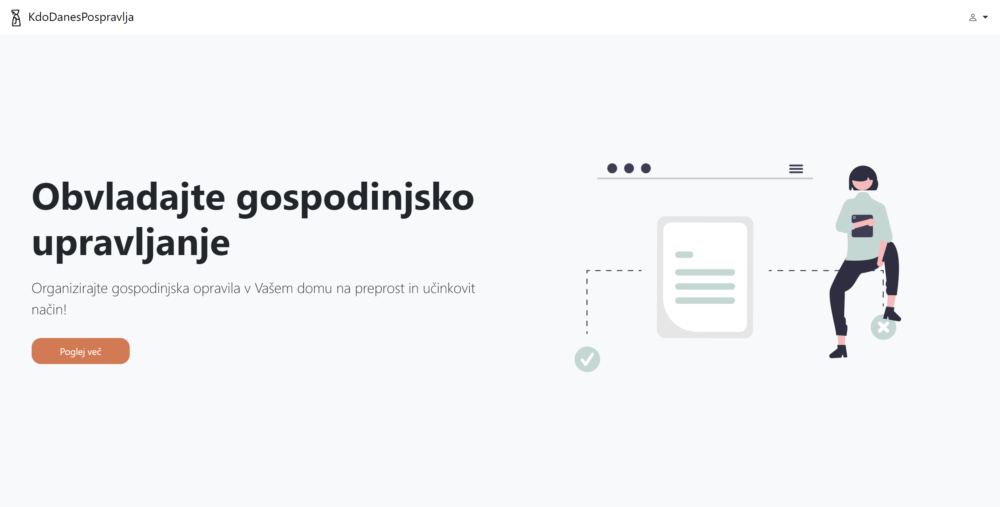
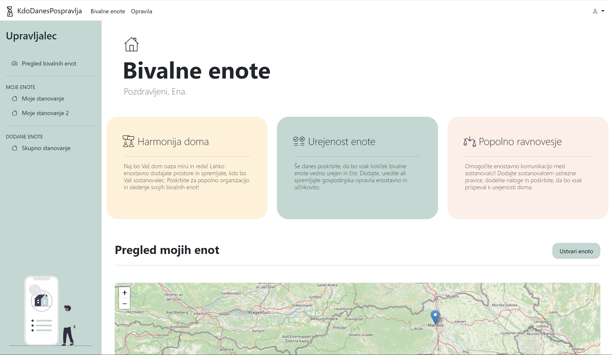
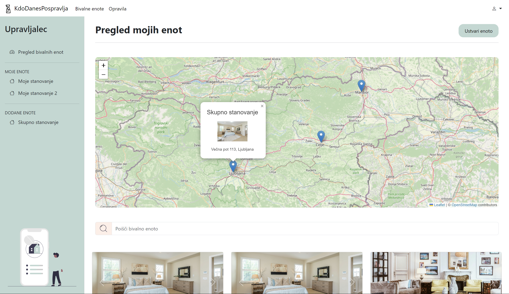
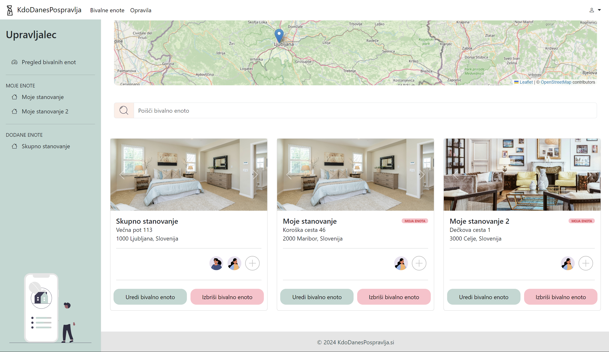
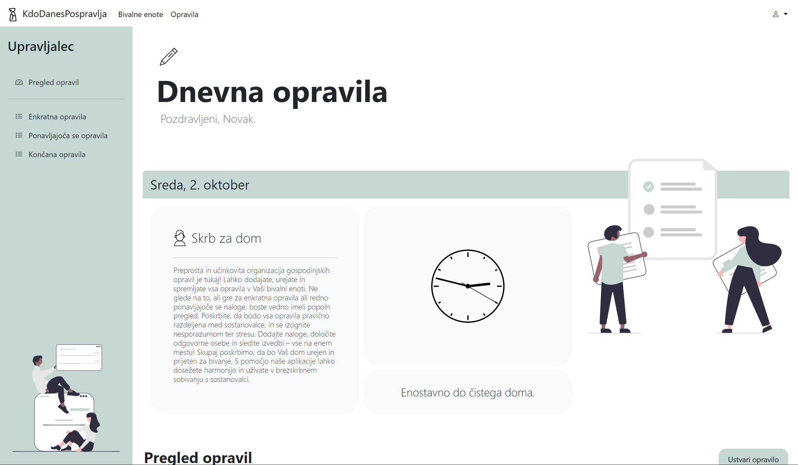
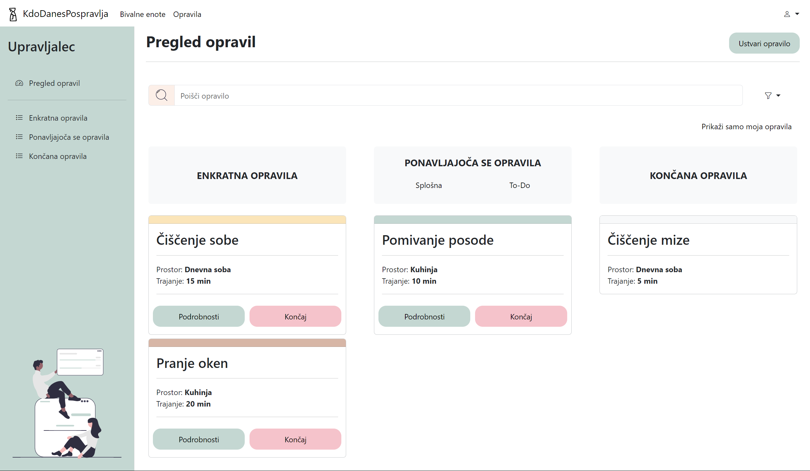

# KdoDanesPospravlja.si

**KdoDanesPospravlja.si** is a web application designed to help roommates living in student dormitories or shared apartments organize and distribute household chores efficiently. The application ensures fair task allocation and tracks task completion through an intuitive interface, allowing users to manage responsibilities across shared living spaces.


## Features

- **User Registration & Login**: Users must register and log in to access the app's functionality.
- **Household Management**: Users can create and manage living units, including adding roommates with either full or limited permissions.
- **Living Unit Map View**: Living units are displayed on a map, with a clickable pin that shows the name, location, and an image of the unit.
- **Task Management**: Users can add, edit, and delete tasks. Tasks can be one-time or recurring (daily, weekly, monthly, yearly).
- **Automated Task Rotation**: For recurring tasks, responsibilities can be rotated automatically among the assigned roommates.
- **Task Reminders**: Users responsible for tasks receive email reminders on the scheduled date.
- **Task Status Indicators**: The top border color of each task changes based on the task’s end date to indicate its status.
- **Overview and Sorting**: View and sort tasks for each living unit by different parameters such as date, task type, and room.


## Installation

To set up and run this project locally, follow the steps below:

1. Clone the repository:
   ```bash
   git clone https://github.com/oneInSlo/Kdo-Danes-Pospravlja.git
    ```

2. Navigate to the project directory.

3. Install backend dependencies:

    ```bash
    cd backend
    npm install
    ```

4. Set up the database:
    - Create the database by running the provided SQL script in the `Database` folder.
    - Adjust any database configuration settings if necessary (`knexfile.js`).

5. Run the backend server:

    ```bash
    node server.js
    ```

6. Access the application through `localhost` and start adding users, tasks, and managing your household!


## Technologies Used

[![HTML][HTML-shield]][HTML-url] [![CSS][CSS-shield]][CSS-url] [![Bootstrap][Bootstrap-shield]][Bootstrap-url] [![JavaScript][JavaScript-shield]][JavaScript-url] [![Node.js][Node.js-shield]][Node.js-url] [![SQL][SQL-shield]][SQL-url] [![OpenStreetMap][OpenStreetMap-shield]][OpenStreetMap-url]


## Team Members

- Neo Xander Kirbiš
- Gal Petelin
- Gaj Korošec
- Jurij Dumić
- Ena Imamović


## Screenshots

### Landing Page


### Living Units




### Tasks




## License

Distributed under the MIT License. See `LICENSE.txt` for more information.


[HTML-shield]: https://img.shields.io/badge/HTML-E34F26?style=for-the-badge&logo=html5&logoColor=white
[HTML-url]: https://developer.mozilla.org/en-US/docs/Web/HTML
[CSS-shield]: https://img.shields.io/badge/CSS-1572B6?style=for-the-badge&logo=css3&logoColor=white
[CSS-url]: https://developer.mozilla.org/en-US/docs/Web/CSS
[Bootstrap-shield]: https://img.shields.io/badge/Bootstrap-563D7C?style=for-the-badge&logo=bootstrap&logoColor=white
[Bootstrap-url]: https://getbootstrap.com
[JavaScript-shield]: https://img.shields.io/badge/JavaScript-F7DF1E?style=for-the-badge&logo=javascript&logoColor=black
[JavaScript-url]: https://developer.mozilla.org/en-US/docs/Web/JavaScript
[Node.js-shield]: https://img.shields.io/badge/Node.js-339933?style=for-the-badge&logo=nodedotjs&logoColor=white
[Node.js-url]: https://nodejs.org/
[SQL-shield]: https://img.shields.io/badge/SQL-003B57?style=for-the-badge&logo=postgresql&logoColor=white
[SQL-url]: https://en.wikipedia.org/wiki/SQL
[OpenStreetMap-shield]: https://img.shields.io/badge/OpenStreetMap-7EBC6F?style=for-the-badge&logo=openstreetmap&logoColor=white
[OpenStreetMap-url]: https://www.openstreetmap.org/